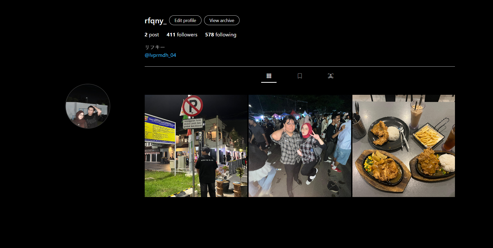

# 📸 Instagram Profile Clone

Proyek ini adalah halaman web statis yang meniru tampilan **profil Instagram** menggunakan kombinasi **HTML**, **Bootstrap 5**, **Tailwind CSS**, dan **Bootstrap Icons**.  

---

## 🚀 Teknologi yang Digunakan

- **HTML5** → struktur dasar halaman.  
- **Bootstrap 5 (CDN)** → sistem grid dan komponen siap pakai (container, row, col, button).  
- **Tailwind CSS (CDN)** → styling utility-first (warna, font, padding, responsif).  
- **Bootstrap Icons (CDN)** → ikon tab (grid, bookmark, tagged).  

---

## 🎨 Fitur yang Ada

- Foto profil bundar dengan border.  
- Username + tombol aksi (**Edit Profile**, **View Archive**).  
- Statistik profil (**post, followers, following**).  
- Bio dengan teks + link.  
- Tab navigasi dengan ikon (Posts, Saved, Tagged).  
- Grid postingan 3 kolom (gambar responsif).  

---

## 📱 Responsifitas

- **Bootstrap Grid**:  
  - `col-4 col-md-3` → foto profil.  
  - `col-8 col-md-9` → info profil.  
- **Tailwind Utility**:  
  - `text-xl md:text-2xl` → ukuran font berubah sesuai lebar layar.  
  - `text-white-50 hover:text-white` → efek hover pada ikon tab.  

---
## 📷 Preview

### Tailwind & Bootstrap

